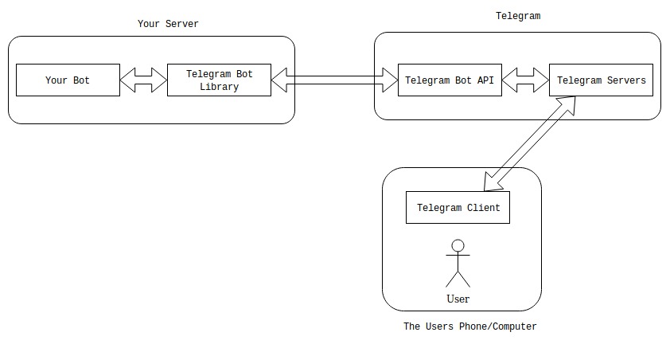
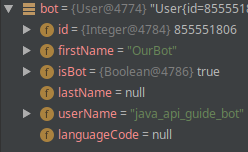
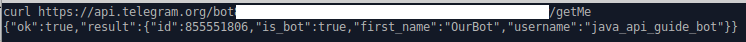
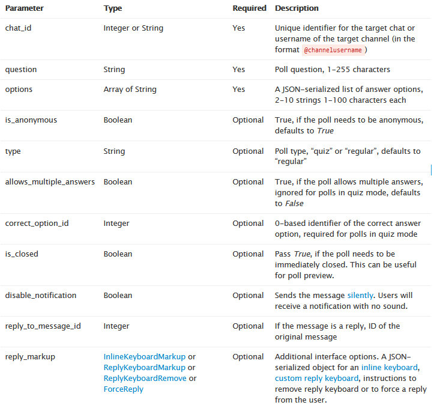
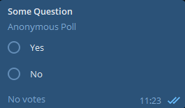

# Understanding the Library
Last updated: 2020-03-04


This little handy guide will not teach you how to do a particular thing in the library. 
It will also not teach you how to create bots or anything in the liking of that. 
For that take a look at the [Getting Started] guide

This guide will give you a general understanding on how the library function and will answer a lot of frequently 
asked questions. I recommend everyone who wants to work with this library more to read this guide.

## Topics
* The library and the bot API
* Understanding how the API is mapped in the library
* The general infrastructure of the library

## The Library and the Bot API
Often in Conversations about the library they talk about the API or Application Programming Interface. Sometimes these 
terms are used interchangeably, which is not correct.

To understand the differences between those two things lets take a look at this diagram



As you might have noticed. Our bot never actually talks to the user directly. Actually, Every communication between user 
and bot happens on the Telegram Servers (A little disclaimer. I actually don't know the entire infrastructure of telegram. 
So take everything between Bot API and Telegram Client with a grain of salt)

Important is that the Library communicates with the Telegram Bot API for everything. Sending Messages, Sending Pictures, 
and receiving Updates from Telegram

So we can conclude that the Library is the part of your code that handles all the communication between your bot and the
Bot API. The Bot API is the actual interface telegram offers to implement bots. Everything we can do in the library, 
we can also do directly calling the library.

Take this piece of code:
```java
// We initialize our bot in a separate method. See this as the initialization code from the getting started guide
AbsSender ourBot = getOurBot();

// We create the Method class. This one doesn't need any parameters to be able to be send
GetMe getMe = new GetMe();

// At last, we just need to execute the method and get the result
User bot = ourBot.execute(getMe);
```

If we do this for one of our bots this is what theBot will look like:<br>


(you better be grateful for that picture. Spend an eternity trying to find a username)

We can also go ahead and just call the bot api directly:<br>


We get the same result. The library just handily maps it to an object for us to work with.

So how do we find out how to do things with the library?

## Understanding how the API is mapped in the library
The base for all our operations is the [telegram bot api documentations](https://core.telegram.org/bots/api) . This 220 kB monster of a website will tell us almost everything we need to know about how to use the api.

It is split into multiple sections. We can ignore the sections *Authorizing your bot", "Making Requests" and "Getting Updates". These things are done for us by the library.

So, let's see how we can send a poll for example. First, lets take a look at the *Available Methods*. It already gives us a bunch of send methods

* sendMessage
* sendPhoto
* sendAudio
* sendDocument
* sendVideo
* sendAnimation
* sendVoice
* sendVideoNote
* sendMediaGroup
* sendLocation
* sendVenue
* sendContact
* sendPoll
* sendChatAction

One of them sticks out to us. *sendPoll* looks promising, and when we take a look at the description

`Use this method to send a native poll. On success, the sent Message is returned`

That looks like the thing we need. So let's see what we need to send it


So as we can see, we need to set 3 things. The id of the chat we want to send it to, a question as a string and an Array of Strings.
This will result in an anonymous regular type poll without mutliselection looking like this when sent:



We can customize a bunch of other things like create quizzes, send closed polls or reply to a certain message. Now, how is this api object mapped in the library? How *do* we create a poll?

Pretty straight forward. We take our libary, look for the "Go To Class" or "SearchClass" option and type in the name of the Method we are looking for. This will quickly yield a "SendPoll" method.

**Every** Method, listed under *Available Methods* has such a Class. And if we go ahead and scroll down a bit we find a set of fields for the class

```java
@JsonProperty(CHATID_FIELD)
private String chatId; ///< Unique identifier for the target chat or username of the target channel (in the format @channelusername)
@JsonProperty(QUESTION_FIELD)
private String question; ///< Poll question, 1-255 characters
@JsonProperty(OPTIONS_FIELD)
private List<String> options = new ArrayList<>(); ///< List of answer options, 2-10 strings 1-100 characters each
@JsonProperty(ISANONYMOUS_FIELD)
private Boolean isAnonymous; ///< Optional	True, if the poll needs to be anonymous, defaults to True
@JsonProperty(TYPE_FIELD)
private String type; ///< Optional	Poll type, “quiz” or “regular”, defaults to “regular”
@JsonProperty(ALLOWMULTIPLEANSWERS_FIELD)
private Boolean allowMultipleAnswers; ///< Optional	True, if the poll allows multiple answers, ignored for polls in quiz mode, defaults to False
@JsonProperty(CORRECTOPTIONID_FIELD)
private Integer correctOptionId; ///< Optional	0-based identifier of the correct answer option, required for polls in quiz mode
@JsonProperty(ISCLOSED_FIELD)
private Boolean isClosed; ///< Optional	Pass True, if the poll needs to be immediately closed
@JsonProperty(DISABLENOTIFICATION_FIELD)
private Boolean disableNotification; ///< Optional. Sends the message silently. Users will receive a notification with no sound.
@JsonProperty(REPLYTOMESSAGEID_FIELD)
private Integer replyToMessageId; ///< Optional. If the message is a reply, ID of the original message
@JsonProperty(REPLYMARKUP_FIELD)
@JsonDeserialize()
private ReplyKeyboard replyMarkup; ///< Optional. JSON-serialized object for a custom reply keyboard
```

This is a lot at first glance, but if we remember back at the table from the documentation, everything is there. We have the 3 required fields on top (chatId, question and the list of options and everything) else below

Let's reproduce our poll from earlier. We create the Method object and set all required fields. This particular class already allows us to set everything in a constructor, this is normally the case for required fields. All other fields can be set by using the setter method (**Attention** Calling a setter overrides the last value in a field. You can call setter multiple times on a method object, but it's normally not correct to do so)

```java
AbsSender ourBot = getOurBot();

List<String> options = new List<>();
options.add("Yes");
options.add("No");

// Let's just assume we get the chatMessage as a parameter. For example from the message received, or from a database
SendPoll ourPoll = new SendPoll(someChatId, "Some Question", options);

ourBot.execute(ourPoll);
```
This will send the message as expected to telegram and finally to the given chat. But what about return values?

If we go back to the documentation and look at the description it says:
`Use this method to send a native poll. On success, the sent Message is returned`
Message links us to the Message object. An object so big that i wont be showing it's documentation in this guide. It can be found here: [Telegram Bot Api: Message Object](https://core.telegram.org/bots/api#message)

Just the documentation tells us that it returns a Message object. How do we get that object? Easy. Execute() returns it.

```java
Message thePollMessage = ourBot.execute(ourPoll);
```
This again works for any method that returns a value. SendMessage, SendPhoto, SendPoll, GetMe, GetChatMember etc.

## But what about Photos?
Some methods aren't quite as straight forward to use. Let's take a bit of time to look at methods that upload files to telegram. Namely: SendPhoto, SendAnimation, SendSticker, SendDocument, SendVideo, SendVideoNote, SendAudio and SendVoice. All of these require what telegram calls an "InputFile". This can either be a FileId of a previous send file, a url to the file on a public sever or the actual file. In the Library this is mapped using different set methods in the above classes. Currently sending by FileId, sending by java.io.File and sending by InputStream is supported. Sending by URL is not supported as of writing this guide

### FileId
Using a fileId is pretty straight forward. The FileId is returned from telegram upon sending a File. Just set the given FileId and execute the method. Make sure that the FileId actually point to a file of the correct type

### File
The classic approach of creating a java.io.File by Path on your hard drive or by loading a classpath resource. 

### InputStream
Sending a file by InputStream will cause the library to read the stream and then converting it into the Request. It's the same as sending a java.io.File, but more convenient some times.

For more information on how to send Files, take a look at the [FAQ: How to send Photos](../FAQ.md). The basic concept will be the same across all Methods.
